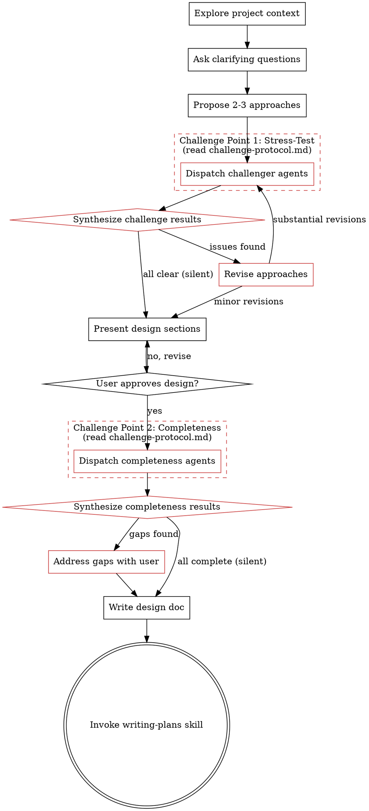

# Brainstorming Ideas Into Designs (with Challengers)

## Usage

To start: say **"brainstorm with challengers"** or invoke the skill directly.

## Overview

Help turn ideas into fully formed designs and specs through natural collaborative dialogue, then stress-test them through a team of parallel challenger agents before finalizing.

Start by understanding the current project context, then ask questions one at a time to refine the idea. Once you understand what you're building, propose approaches, run them through a challenger team, then present the strongest design and get user approval.

<HARD-GATE>
Do NOT invoke any implementation skill, write any code, scaffold any project, or take any implementation action until you have presented a design and the user has approved it. This applies to EVERY project regardless of perceived simplicity.
</HARD-GATE>

## Anti-Pattern: "This Is Too Simple To Need A Design"

Every project goes through this process. A todo list, a single-function utility, a config change — all of them. "Simple" projects are where unexamined assumptions cause the most wasted work. The design can be short (a few sentences for truly simple projects), but you MUST present it and get approval.

## Checklist

You MUST create a task for each of these items and complete them in order:

1. **Explore project context** — check files, docs, recent commits
2. **Ask clarifying questions** — one at a time, understand purpose/constraints/success criteria
3. **Propose 2-3 approaches** — with trade-offs and your recommendation
4. **Challenge approaches** — read `challenge-protocol.md` (in the same directory as this skill) and run Challenge Point 1 (stress-test)
5. **Present design** — in sections scaled to their complexity, get user approval after each section
6. **Challenge completeness** — read `challenge-protocol.md` (in the same directory as this skill) and run Challenge Point 2 (completeness check)
7. **Write design doc** — save to `docs/plans/YYYY-MM-DD-<topic>-design.md` and ask user if they want to commit
8. **Transition to implementation** — invoke `superpowers:writing-plans` skill to create implementation plan

## Process Flow

**The terminal state is invoking writing-plans.** Do NOT invoke frontend-design, mcp-builder, or any other implementation skill. The ONLY skill you invoke after brainstorming is `superpowers:writing-plans`.

## The Process

**Understanding the idea:**
- Check out the current project state first (files, docs, recent commits)
- Before asking detailed questions, assess scope: if the request describes multiple independent subsystems, flag this immediately. Don't spend questions refining details of a project that needs to be decomposed first.
- If the project is too large for a single spec, help the user decompose into sub-projects. Each sub-project gets its own spec → plan → implementation cycle.
- Ask questions one at a time to refine the idea
- Prefer multiple choice questions when possible, but open-ended is fine too
- Only one question per message
- Focus on understanding: purpose, constraints, success criteria

**Exploring approaches:**
- Propose 2-3 different approaches with trade-offs
- Present options conversationally with your recommendation and reasoning
- Lead with your recommended option and explain why

**Presenting the design:**
- Once you believe you understand what you're building, present the design
- Scale each section to its complexity: a few sentences if straightforward, up to 200-300 words if nuanced
- Ask after each section whether it looks right so far
- Cover: architecture, components, data flow, error handling, testing
- Be ready to go back and clarify if something doesn't make sense

**Design for isolation and clarity:**
- Break the system into smaller units that each have one clear purpose, communicate through well-defined interfaces, and can be understood and tested independently
- Smaller, well-bounded units are easier to work with — you reason better about code you can hold in context at once

**Working in existing codebases:**
- Explore the current structure before proposing changes. Follow existing patterns.
- Where existing code has problems that affect the work, include targeted improvements as part of the design
- Don't propose unrelated refactoring. Stay focused on what serves the current goal.

## After the Design

**Documentation:**
- Write the validated design to `docs/plans/YYYY-MM-DD-<topic>-design.md`
- Use elements-of-style:writing-clearly-and-concisely skill if available
- Do NOT auto-commit. Ask the user if they want to commit after they've verified the file.

**Implementation:**
- Invoke the `superpowers:writing-plans` skill to create a detailed implementation plan
- Do NOT invoke any other skill. writing-plans is the next step.
- If `superpowers:writing-plans` is not available, inform the user: "The superpowers plugin is required for the next step. Please install it to continue."

## Key Principles

- **One question at a time** - Don't overwhelm with multiple questions
- **Multiple choice preferred** - Easier to answer than open-ended when possible
- **YAGNI ruthlessly** - Remove unnecessary features from all designs
- **Explore alternatives** - Always propose 2-3 approaches before settling
- **Incremental validation** - Present design, get approval before moving on
- **Be flexible** - Go back and clarify when something doesn't make sense
- **Silent by default** - Challenges that find nothing add no noise to the conversation
- **Constructive, not critical** - Challengers must propose better alternatives, not just flag problems
- **Team consensus** - Only revise when challengers identify genuine improvements, not nitpicks
